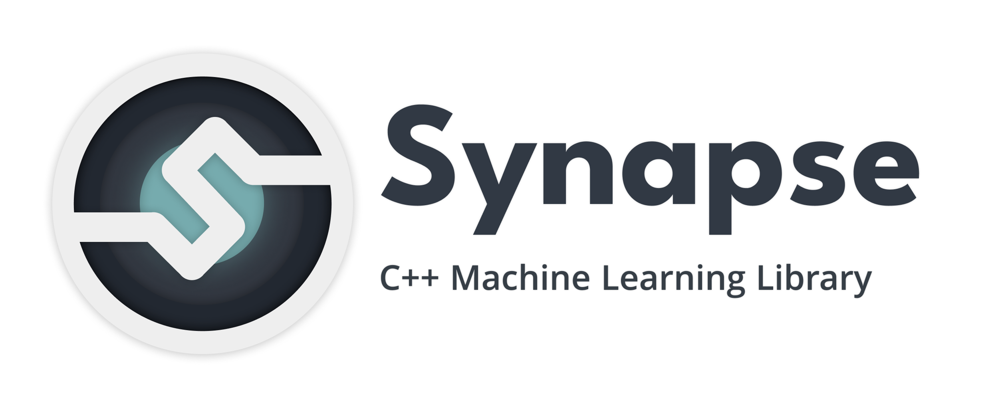

 

# Synapse — C++ Machine Learning Library

Synapse is a simple and fast C++ machine learning library that automates processes of creating and learning machine learning models. The main aims of this project are to make C++ AI-development more simple and to stimulate emergence of new AI-startups and projects.

## State of Development

Project is now available in demo version. Development is focused on implementing base functionality and fixing bugs.

## How to build

CMake build system is used here, so you'll need it downloaded. To build Synapse, just navigate to its root folder and paste folowing commands:

```bash
mkdir build
cd build
cmake -DCMAKE_BUILD_TYPE=Release ..
cmake --build .
```

## How to use

There are two main thing you should remember when dealing with Synapse libarary:
* Its headers (you need to **include** them to your project when compiling it)
* Its binaries (these have `.so` or `.dll` extensions. You should **link** them)

You can find these in include and lib folders of Synapse's root folder respectively.

**Linux:**

```bash
g++ -c main.cpp -I<synapse-install-path>/include
g++ main.o -o synapse-app -L<synapse-install-path>/lib -lsynapse-mll -lsynapse-linear
```

**CMake:**

```cmake
cmake_minimum_required(VERSION 3.18)
project(SynapseTest)

set(CMAKE_CXX_STANDARD 17)

link_directories(${CMAKE_SOURCE_DIR}/lib)

add_executable(synapse-test main.cpp)

target_include_directories(${TARGET} PUBLIC ${CMAKE_SOURCE_DIR}/include)
target_link_libraries(${TARGET} PUBLIC synapse-mll synapse-linear)
```

## Examples of code

Here is a simple example of using Synapse:

```c++
#include <Synapse/AI.h>

int main() {
  syn::Data inputs({2, 1}, {0, 0}, {0, 1}, {1, 0}, {1, 1});
  syn::Data labels({1, 1}, {0}, {1}, {1}, {0});

  syn::Model model({
    new syn::Dense(2, 3), new syn::Activation("leaky relu"),
    new syn::Dense(3, 1), new syn::Activation("sigmoid),
  });
  model.compile("MSE", "GD");

  model.train(30);
  model.save("models/model.txt");
}
```

In this example we are manualy creating learning data and model. You also can use special Synapse functionality, that will automaticaly generate a model with the most suitable architectire.

```c++
#include <Synapse/AI.h>

int main() {
  syn::Data inputs({2, 1}, {0, 0}, {0, 1}, {1, 0}, {1, 1});
  syn::Data labels({1, 1}, {0}, {1}, {1}, {0});

  syn::Model model(inputs, labels);

  model.save("models/model.txt");
}
```
## Available functionality

**syn::Model Interface Reference:**
| Method's name | Explaination |
| :------------- | :--- |
| compile | Set optimizer and loss function |
| predict | Push some input to model and get some output |
| train | Train model |
| evaluate | Get current loss value |

**syn::Data Interface Reference:**
| Method's name | Explaination |
| :------------- | :--- |
| shuffle | Shuffle data |
| size | Get size of data |
| merge | Merge two data instances to a signle one |
| extract | Get some part of a data |

**Layers:**
| Name | How to call in Synapse |
| :----- | :--- |
| Dense | syn::Dense(int nInput, int nOutput) |
| Activation | syn::Activation(const std::string& type)  |
| Convolutional | syn::Conv() |

**Activation functions:**
| Name | How to call in Synapse |
| :----- | :---: |
| ReLU | "relu"   |
| Leaky ReLU | "leaky relu"  |
| Sigmoid | "sigmoid"  |

**Loss functions:**
| Name | How to call in Synapse |
| :----- | :---: |
| Mean Squared Error | "MSE"   |
| Binary Cross-Entropy | "BCE"   |
| Categorical Cross-Entropy | "CCE"   |

**Optimizers:**
| Name | How to call in Synapse |
| :----- | :---: |
| Gradient Descent | "GD"   |
| Sticastic Gradient Descent | "SGD"   |

